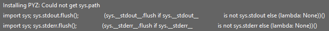
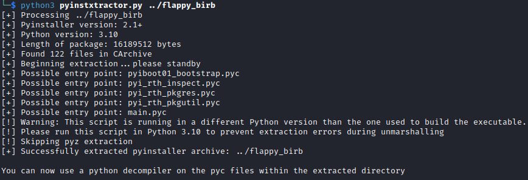
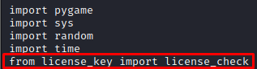

> Whiterose is wary of you and the pride you take in stopping unethical hacks. Gift them a cracked flappy bird game to raise confusion regarding your morals and buy yourself some time.
---

In the executable file, we see lines indicating that the source code was written in Python.



Let's try to get PYZ files. PYZ is a Python file placed in a Zip archive. [Pyinstxtractor](https://github.com/extremecoders-re/pyinstxtractor) displays a warning that some files cannot be retrieved because Python version 3.10 is required.



By installing Python 3.10 we get all the PYC files. Using [pycdc](https://github.com/zrax/pycdc) we get the source file main.py. Among the imported libraries we see the license_check imported from the license_key file.



The file license_key.py stores the encrypted flag, using the same encryption algorithm we get the original flag!

```python
import sys

def custom_encode(data):
    encoded_data = ''
    for char in data:
        if char.isalpha():
            if char.isupper():
                encoded_char = chr(((ord(char) - 65) + 13) % 26 + 65)
            else:
                encoded_char = chr(((ord(char) - 97) + 13) % 26 + 97)
        else:
            encoded_char = char
        encoded_data += encoded_char
    return encoded_data


def custom_decode(encoded_data):
    return custom_encode(encoded_data)


def license_check(user_input_key):
    if user_input_key == custom_decode('PUPGS{JU3A_J3_1053_0He_Ce1AP1C135_J3_1AI173_PU405}'):
        print('Premium Content Unl0cked!!!')
    else:
        print('Sorry license check failed. Please enter valid key.')
    sys.exit()
```

---
> Flag: **CHCTF{WH3N_W3_1053_0Ur_Pr1NC1P135_W3_1NV173_CH405}**