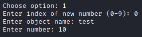

> Sorry, I lost the task description...
---

Open the source code in IDA Pro. We see that we can manage an "array" of 10 numbers and initialize a random number. There is also a function printFlag, which is never called.


Program Menu:


We can write a number and delete it, it looks like a UAF vulnerability. Let's see how it looks in memory. I will debug the program in EDB. Let's write the data:



This is what it looks like in memory (just above the list of object names):


Now delete the data and look at the same memory area:


We see that our number 10 (0x0A) remains in memory. That is, only the name of the object is erased when we delete it. There is an interesting function for creating a random number. Let's select and look at the same memory area:


Instead of our number now lies some address **0x563251a4a257**, and instead of the object name is just a random number. This address is the beginning of the function to create a random number. And the read flag function is 19 bytes higher. Let's try to change the address and call the number creation function again.


As you can see, the program crashed when it tried to address **0x457**, the address is the number 1111, which I typed. Now it remains to do the same thing and overwrite the address of the function to create a random number with the address of the function to read the flag from the file.

As a result, the payload will be as follows:

```python
jmp = io.recvline(1) # get the address
payload = hex(int(jmp[:-1])-19)
```

---
> [Full exploit](number.py)
> 
> Flag: **flag{n3v3r_tru5t_fr33_jVmVsEuj}** 
