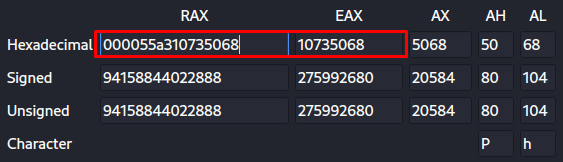

> Luck won't save you here. Have fun trying to get the flag!
---

An executable file and [C source code](unlucky.c) are given.

```C
#include <stdio.h>
#include <stdlib.h>

int main() {
    setvbuf(stdout, NULL, _IONBF, 0);
    setvbuf(stdin, NULL, _IONBF, 0);

    static int seed = 69;
    srand(&seed);

    printf("Here's a lucky number: %p\n", &main);

    int lol = 1;
    int input = 0;
    for (int i = 1; i <= 7; ++i) {
        printf("Enter lucky number #%d:\n", i);
        scanf("%d", &input);
        if (rand() != input) {
            lol = 0;
        }
    }

    if (lol) {
        char flag[64] = {0};
        FILE* f = fopen("flag.txt", "r");
        fread(flag, 1, sizeof(flag), f);
        printf("Nice work, here's the flag: %s\n", flag);
    } else {
        puts("How unlucky :pensive:");
    }
}
```

After analyzing the source code we understand that we need to calculate the address of the variable seed. Also the address of the beginning of the main function is printed to the terminal. We debug using EDB to see what address is printed and what address is passed to `srand()`. Address `0x55a310735068` is passed to the function.




`0x55a3107321a5` at the beginning of main function. Calculate the difference and get that from the beginning of main function we must subtract `0x2ec3`.


Now let's write code in C++ that takes a random seed as an argument and prints 7 random numbers into the terminal.

```C++
#include <stdio.h>
#include <stdlib.h>
#include <cstdlib>

int main(int argc, char *argv[]) {
   int seed = atoi(argv[1]);
  // printf("Seed - %d\n", seed);
   srand(seed);
   for (int i = 1; i <= 7; ++i) {
        printf("%d\n", rand());
   }
}
```

Now we just have to connect to the host, calculate and transfer the random grain to our program, and send the random numbers back to the host. The resulting payload will be as follows:

```python
io.recvuntil("Here's a lucky number: ")
addr = io.recvuntil("\n").split()[0]
seed = int(addr[6:], 16) + 0x2ec3

output = subprocess.check_output(['./rand', f'{str(seed)}'])
nums = output.decode().split('\n')

for i in range(1, 8):
    io.sendlineafter(f'#{i}:', nums[i-1])
```

---
> [Full exploit](unlucky.py)
> 
> Flag: **gigem{1_n33d_b3tt3r_3ntr0py_s0urc3s}**
