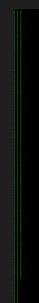

> Our SOC analysts said that in the last few days, some of our employees started to upload a lot of photos on random sites. Check it out.
> 
> Flag Format: TFCCTF{...}.
> 
> Disclaimer (forensics+stegano)
---

Start Wireshark, find 3 POST-requests in the traffic, in which pictures are transmitted. Save the very first picture using "Export packet bytes", then in any hex editor edit the bytes so that at the beginning were the magic bytes PNG (89 50 4E 47). From the description of the task we understand that the image hides the flag using steganography. When we open the picture, a row of green pixels stands out immediately on the left.

Open the image in Stegosolve and play with Data Extract and the green "layer". Since the green pixels are not in a row, but in columns, we select Column instead of Row. And select all levels of green from 0 to 7. We get a flag!

---
> Flag: **TFCCTF{H1dd3n_d4t4_1n_p1x3ls_i5n't_f4n_4nd_e4sy_to_f1nd!}**