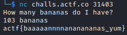

> A friend sent [this](https://files.actf.co/8ab8e79a482fd97ef1d2621dd1102278b24270edd5abb024d6c294f927122b68/Elixir.Bananas.beam) to me. Can you help me find out what they want?
>
>nc challs.actf.co 31403
---

The source file was written in Elixir. To decompile the file you need Erlang code.

```erlang
`%% Author: PCHAPIER`

`%% Created: 25 mai 2010`

`-``module``(utility).`

`%%`

`%% Include files`

`%%`

`%%`

`%% Exported Functions`

`%%`

`-``export``([decompile/1, decompdir/1]).`

`-``export``([shuffle/1]).`

`%%`

`%% API Functions`

`%%`

`decompdir(``Dir``) ->`

    `Cmd` `=` `"cd "` `++` `Dir``,`

    `os:cmd``(``Cmd``),`

    `L =` `os:cmd``(``"dir /B *.beam"``),`

    `L1` `=` `re:split``(L,``"[\t\r\n+]"``,[{return,list}]),`

    `io:format``(``"decompdir: ~p~n"``,[``L1``]),`

    `decompile(``L1``).`

`decompile(``Beam` `= [H|_])` `when` `is_integer(H) ->`

    `io:format``(``"decompile: ~p~n"``,[``Beam``]),`

    `{ok,{_,[{abstract_code,{_,``AC``}}]}} =` `beam_lib:chunks``(``Beam` `++` `".beam"``,[abstract_code]),`

    `{ok,``File``} =` `file:open``(``Beam` `++` `".erl"``,[write]),`

    `io:fwrite``(``File``,``"~s~n"``, [``erl_prettypr:format``(``erl_syntax:form_list``(``AC``))]),`

    `file:close``(``File``);`

`decompile([H|T]) ->`

    `io:format``(``"decompile: ~p~n"``,[[H|T]]),`

    `decompile(removebeam(H)),`

    `decompile(T);`

`decompile([]) ->`

    `ok.`

`shuffle(P) ->`

    `Max` `= length(P)*10000,`

    `{_,R}=` `lists:unzip``(``lists:keysort``(1,[{``random:uniform``(``Max``),X} || X <- P])),`

    `R.`

`%%`

`%% Local Functions`

`%%`

`removebeam(L) ->`

    `removebeam1(``lists:reverse``(L)).`

`removebeam1([$m,$a,$e,$b,$.|T]) ->`

    `lists:reverse``(T);`

`removebeam1(L) ->`

    `lists:reverse``(L).`
```

Start the decompiler:

```bash
erlc utility.erl
iex
```

In the erl shell we write the following:

```bash
iex(1)> :utility.decompile(['Elixir.Bananas.beam'])
```

We get the source code in Erlang:

```erlang
-file("lib/bananas.ex", 1).

-module('Elixir.Bananas').

-compile([no_auto_import]).

-export(['__info__'/1, main/0, main/1]).

-spec '__info__'(attributes |
                 compile |
                 functions |
                 macros |
                 md5 |
                 exports_md5 |
                 module |
                 deprecated |
                 struct) -> any().

'__info__'(module) -> 'Elixir.Bananas';
'__info__'(functions) -> [{main, 0}, {main, 1}];
'__info__'(macros) -> [];
'__info__'(struct) -> nil;
'__info__'(exports_md5) ->
    <<"T�}��|�6�\020�\f\035\005\222\203">>;
'__info__'(Key = attributes) ->
    erlang:get_module_info('Elixir.Bananas', Key);
'__info__'(Key = compile) ->
    erlang:get_module_info('Elixir.Bananas', Key);
'__info__'(Key = md5) ->
    erlang:get_module_info('Elixir.Bananas', Key);
'__info__'(deprecated) -> [].

check([_num@1, <<"bananas">>]) ->
    (_num@1 + 5) * 9 - 1 == 971;
check(__asdf@1) -> false.

convert_input(_string@1) ->
    to_integer('Elixir.String':split('Elixir.String':trim(_string@1))).

main() -> main([]).

main(_args@1) ->
    print_flag(check(convert_input('Elixir.IO':gets(<<"How many bananas do I have?\n">>)))).

print_flag(false) -> 'Elixir.IO':puts(<<"Nope">>);
print_flag(true) ->
    'Elixir.IO':puts('Elixir.File':'read!'(<<"flag.txt">>)).

to_integer([_num@1, _string@1]) ->
    [erlang:binary_to_integer(_num@1), _string@1];
to_integer(_list@1) -> _list@1.
```

We see that we have to answer the question correctly. By calculating the formula in the check function, we get the number 103.



---
> Flag: **actf{baaaaannnnananananas_yum}**